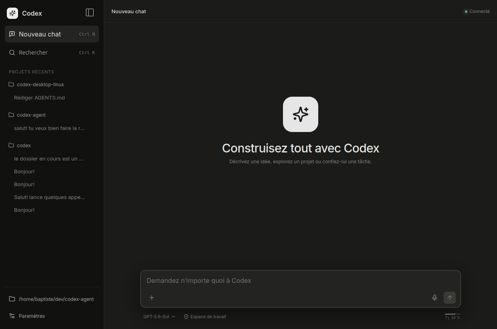
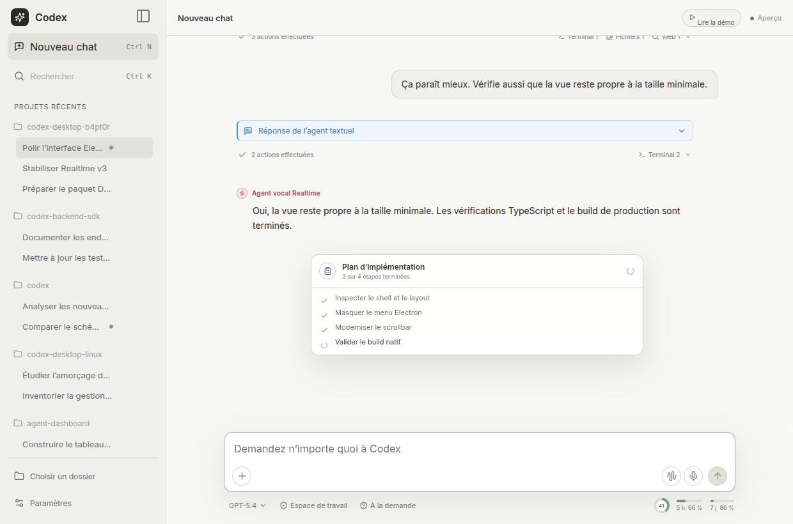

# Codex Desktop Linux

**A polished, Linux-first desktop client for Codex.**

Codex Desktop Linux brings the everyday Codex workflow into a focused Electron
application: persistent conversations, clear agent activity, voice, permissions,
integrations, account usage, and the ergonomics expected from a desktop
development tool.

The project is built in the spirit of the interaction model and App Server
architecture established by Codex. It does not try to reproduce, visually clone,
or pass itself off as the official desktop application. Its purpose is narrower:
give Linux users a reliable, comprehensive, and pleasant desktop surface that
complements the Codex CLI while respecting the product concepts exposed by the
official backend.



> [!IMPORTANT]
> This is an independent community project. It is not an official OpenAI
> product, is not affiliated with or endorsed by OpenAI, and must not be
> presented as one.

## Why this project exists

Linux users can already use Codex from the CLI and the VS Code extension. This
client complements them with a comfortable home for long-running conversations,
visible session controls, rich activity rendering, global configuration, and
voice workflows—without requiring users to leave the application for routine
Codex setup.

The desktop shell, React interface, Linux integration, and App Server protocol
layer were built specifically for this project. The agent itself is not
reimplemented: the application launches the official `codex app-server` from
the installed Codex CLI and treats it as the source of truth for threads,
models, permissions, approvals, account state, and agent activity.

The result is an independent Linux client that stays close to the Codex product
family while remaining free to refine its own interaction design.

## Highlights

### Conversations that remain readable

- Create, resume, search, rename, fork, compact, archive, and delete threads.
- Follow streaming output and page through long histories without losing your
  place.
- Send text, images, file references, connected-app mentions, and skills.
- Steer an active turn, interrupt work safely, and recover from App Server
  failures.
- Render Markdown, GFM, streaming LaTeX, plans, reasoning summaries, warnings,
  citations, generated media, and structured multi-file diffs.
- Keep technical activity compact with progressively disclosed tool groups.

### Codex controls where they are useful

- Choose model, reasoning effort, personality, and collaboration mode.
- Keep permission profiles and approval policy separate and visible.
- Handle command, file-change, user-question, permission, and MCP requests.
- Inspect account state, quotas, reset windows, workspace messages, Apps,
  skills, hooks, and MCP servers.
- Edit `config.toml`, global instructions, and the active workspace's
  `AGENTS.md` through guarded, conflict-aware editors.
- Reload the current thread or restart App Server when a configuration change
  cannot apply live.

### Voice and dictation

- Capture microphone dictation directly into the composer.
- Run full-duplex Realtime voice conversations through App Server and WebRTC.
- Stream both speakers into the conversation while keeping concurrent text
  activity distinguishable.
- Preserve finalized voice exchanges in the parent thread's model context.

Realtime is an experimental App Server capability and may depend on the
connected account. Current App Server versions retain injected voice items for
future model context but do not always project them back into ordinary visual
history.

### A browser shared with the agent

The optional shared-browser workflow gives the user and Codex one visible,
persistent Chromium context:

- one guided activation downloads the Chromium build matching the app-pinned
  Playwright and Playwright MCP versions;
- browser links from the application and Playwright tools used by the agent
  share the same tabs;
- a bundled, app-scoped skill directs browser work to this session without
  modifying global or workspace skills;
- progress, cancellation, repair, disable, and connection failures remain
  visible;
- the system browser is the no-setup fallback.

No system Chromium installation is assumed, and the application never invokes a
distribution package manager for this feature.

### A native-feeling Linux desktop

- Light, dark, and system themes with adjustable interface scale.
- Responsive layouts down to the supported compact window size.
- Keyboard-friendly menus, focus handling, and accessible dialogs.
- System tray, single-instance behavior, optional launch at login, and native
  Debian packaging.



## Platform scope

Linux is the primary platform. Development and packaged validation currently
focus on Ubuntu, with an amd64 Debian package. Broader Debian-family testing and
additional package formats remain future work.

The client follows the installed App Server rather than inferring capabilities
from model names or hard-coded Codex versions. Experimental backend surfaces
are isolated and fail gracefully when unavailable.

## Requirements

- A recent Linux desktop environment.
- An installed and authenticated `codex` CLI available in `PATH`.
- Node.js 22.12 or newer when building from source.

Set `CODEX_EXECUTABLE` to an absolute Codex binary when automatic discovery is
not appropriate.

## Build and install

Download the current `.deb` from
[GitHub Releases](https://github.com/B4PT0R/codex-desktop-b4pt0r/releases/latest),
then install it with:

```bash
sudo apt install ./codex-desktop-linux_0.3.2_amd64.deb
```

To build from source instead, clone the repository, install the locked
dependencies, and build the Debian package:

```bash
npm ci
npm run electron:deb
sudo apt install ./dist/codex-desktop-linux_0.3.2_amd64.deb
```

Launch the installed application from the desktop menu or run:

```bash
codex-desktop
```

For desktop development:

```bash
npm install
npm run electron:dev
```

For interface-only work, the browser preview provides simulated data:

```bash
npm run dev
```

The preview is useful for visual iteration but does not replace verification
against Electron and a real App Server.

## Data and security

Codex authentication and backend configuration remain owned by the official
Codex installation. This client does not copy authentication tokens into its
own settings.

Client preferences are stored atomically in:

```text
~/.codex/codex-desktop-linux.json
```

Official Codex configuration remains in:

```text
~/.codex/config.toml
```

The renderer is sandboxed and context-isolated. Native operations use focused
IPC boundaries rather than generic filesystem or command access. Destructive
actions, host commands, and sensitive permissions remain explicit.

On Ubuntu 24.04 and newer, AppArmor can interfere with the user namespaces used
by Codex sandboxing. Follow the targeted
[Ubuntu Bubblewrap and AppArmor guide](docs/ubuntu-bubblewrap-apparmor.md);
never disable AppArmor globally.

## Verification

The routine verification matrix is:

```bash
npm run check
npm test
npm run test:electron
npm run build
```

Protocol changes are additionally checked against the schema generated by the
installed Codex binary:

```bash
npm run test:contract
```

## Contributing

This repository is designed to be continued with Codex. A contributor can open
the checkout, ask the agent to inspect the current handoff and App Server
schema, implement one bounded change, run the relevant checks, and leave the
project ready for the next person.

Start with:

- [AGENTS.md](AGENTS.md) — contributor contract and definition of done;
- [TODO.md](TODO.md) — current baseline and prioritized work;
- [UI_ARCHITECTURE.md](UI_ARCHITECTURE.md) — durable interface decisions;
- [APP_SERVER_COVERAGE.md](APP_SERVER_COVERAGE.md) — protocol coverage and
  intentional exclusions;
- [CHANGELOG.md](CHANGELOG.md) — user-visible release history;
- [screenshots/README.md](screenshots/README.md) — curated visual checkpoints.

Prefer focused, testable improvements that handle loading, failure,
unavailable, cancellation, and recovery states—not only the happy path.
