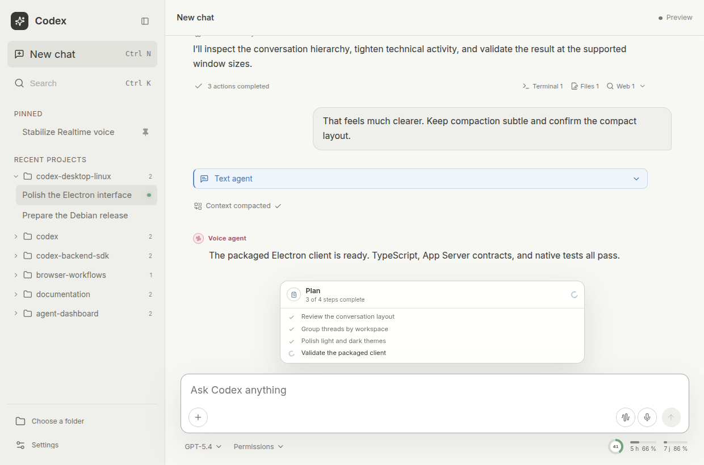
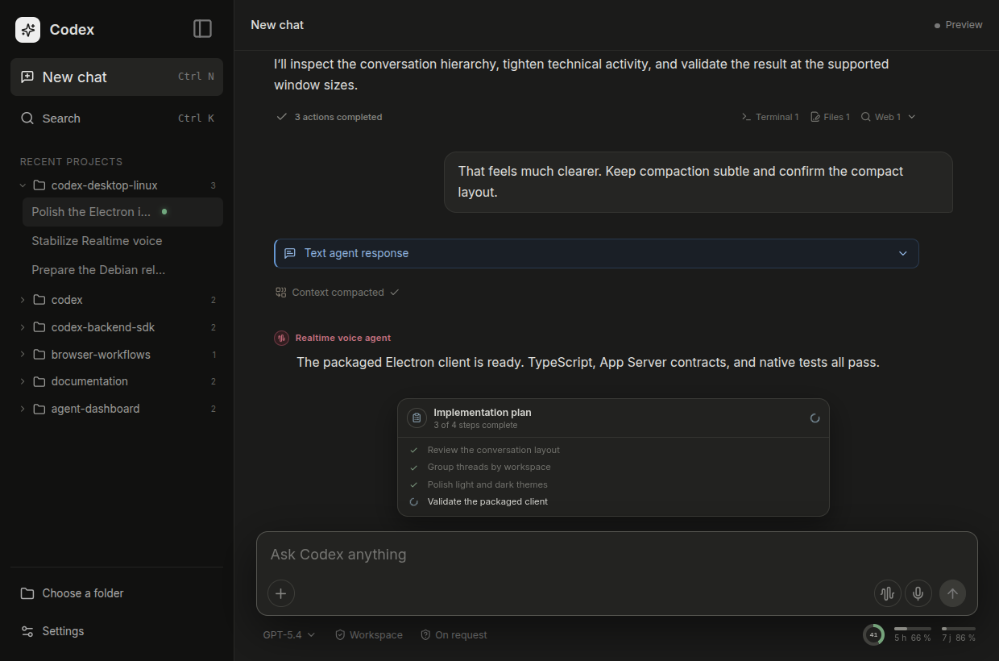

# Codex Desktop Linux

Codex Desktop Linux is an independent Electron client for Codex on Linux. It
uses the official `codex app-server` provided by the installed Codex CLI and
adds a desktop interface for conversations, agent activity, configuration,
voice, scheduled work, and browser collaboration.

The project complements the CLI and VS Code extension; it does not replace or
reimplement the Codex agent. It is a community project and is not affiliated
with, endorsed by, or distributed by OpenAI.



## What it covers

### Conversations and agent activity

- Create, resume, search, rename, fork, compact, archive, and delete
  conversations.
- Follow multiple active threads with isolated streaming state and recover from
  App Server reconnects.
- Send text, images, file references, Apps mentions, and skills; steer or stop
  an active turn.
- Render streaming Markdown and LaTeX, plans, reasoning summaries, grouped tool
  activity, approvals, citations, generated images, and multi-file diffs.
- Browse long histories while preserving the reading position and progressive
  disclosure of technical details.

### Models, permissions, and configuration

- Select the model, reasoning effort, personality, collaboration mode,
  permissions, and approval policy.
- Review account usage, quotas, reset windows, workspace messages, skills,
  Apps, hooks, and MCP servers.
- Edit `config.toml`, global instructions, and the current workspace's
  `AGENTS.md` with conflict-aware editors.
- Reload a conversation or restart App Server when a setting cannot apply to a
  running session.
- Use local Codex memory controls without mixing client preferences with
  backend configuration.

### Voice and scheduled work

- Dictate into the composer or run full-duplex Realtime voice conversations.
- Keep finalized voice exchanges in the parent conversation's model context.
- Start a quick headless voice session from the system tray and reconnect the
  interface to it later.
- Schedule one-time or recurring tasks in the default, an existing, a new, or
  an ephemeral conversation.
- Queue scheduled work safely when its target conversation is already active.

Realtime is an experimental App Server capability and depends on support from
the connected account. Current App Server versions retain injected voice
context but may not reproduce every voice item in ordinary conversation replay.

### Shared browser

The optional shared-browser feature gives the user and Codex the same visible,
persistent Chromium session. Activation downloads the Chromium version matching
the Playwright and Playwright MCP packages shipped with the app. Links opened by
the client and browser actions requested by the agent can then use the same
tabs.

Download progress, cancellation, repair, and connection errors are surfaced in
the interface. No system Chromium installation is required; the system browser
remains the fallback when the shared browser is disabled or unavailable.

### Linux desktop integration

- Light, dark, and system themes with adjustable interface scale.
- Responsive layouts, including a compact chat-column window.
- Keyboard-accessible menus, dialogs, and focus handling.
- System tray, single-instance behavior, optional launch at login, and Debian
  packaging.



## How it works

The Electron main process starts the installed `codex app-server` and
communicates with it over JSON-RPC. App Server remains the source of truth for
conversations, models, permissions, approvals, account state, and agent events.
The renderer is sandboxed and accesses native features through focused IPC
boundaries.

Linux is the primary target. Packaged testing currently focuses on Ubuntu and
the amd64 Debian package; broader Debian-family coverage and other package
formats remain future work. Experimental backend features are isolated and
degrade gracefully when unavailable.

## Requirements

- A recent Linux desktop environment.
- An installed and authenticated Codex CLI available as `codex` in `PATH`.
- Node.js 22.12 or newer when building from source.

Set `CODEX_EXECUTABLE` to the absolute path of the Codex binary if automatic
discovery is not suitable.

## Install

Download the current `.deb` from
[GitHub Releases](https://github.com/B4PT0R/codex-desktop-b4pt0r/releases/latest),
then run:

```bash
sudo apt install ./codex-desktop-linux_0.3.16_amd64.deb
```

Launch **Codex Desktop** from the application menu or run:

```bash
codex-desktop
```

The version panel under **Settings > General** can check GitHub Releases for a
new stable package. The app verifies the downloaded file's published size and
SHA-256 digest and Debian metadata, then asks Polkit to authorize an explicit
APT upgrade. The package is installed only after that authorization succeeds.
Restart the app when the update panel reports that installation is complete.

## Build from source

Install the locked dependencies and build the Debian package:

```bash
npm ci
npm run electron:deb
sudo apt install ./dist/codex-desktop-linux_0.3.16_amd64.deb
```

Run the complete desktop environment during development with:

```bash
npm run electron:dev
```

For interface-only work, Vite provides a browser preview with simulated data:

```bash
npm run dev
```

The preview is intended for visual iteration. Native behavior still needs to be
verified in Electron against a real App Server.

## Data and security

Codex authentication and backend configuration remain owned by the official
Codex installation. The client does not copy authentication tokens into its
own settings.

Client preferences are stored atomically in:

```text
~/.codex/codex-desktop-linux.json
```

Official Codex configuration remains in:

```text
~/.codex/config.toml
```

Destructive operations, host commands, permissions, and approvals remain
explicit. On Ubuntu 24.04 and newer, AppArmor may interfere with the user
namespaces used by Codex sandboxing. Follow the targeted
[Ubuntu Bubblewrap and AppArmor guide](docs/ubuntu-bubblewrap-apparmor.md); do
not disable AppArmor globally.

## Verification

Run the routine checks with:

```bash
npm run check
npm test
npm run test:electron
npm run build
```

Protocol changes should also be checked against the schema generated by the
installed Codex binary:

```bash
npm run test:contract
```

## Contributing

Start with [CONTRIBUTING.md](CONTRIBUTING.md). The repository keeps the context
needed for a contributor—or a Codex session—to pick up one focused change:

- [AGENTS.md](AGENTS.md) defines the contributor contract and completion
  criteria.
- [TODO.md](TODO.md) records the current baseline and next work.
- [UI_ARCHITECTURE.md](UI_ARCHITECTURE.md) documents durable interface
  decisions.
- [APP_SERVER_COVERAGE.md](APP_SERVER_COVERAGE.md) tracks protocol coverage and
  intentional exclusions.
- [CHANGELOG.md](CHANGELOG.md) contains the user-visible release history.

Keep changes bounded, test the relevant failure and unavailable states, and
update the handoff when a decision affects future work.

## License

Codex Desktop Linux is available under the [MIT License](LICENSE).
